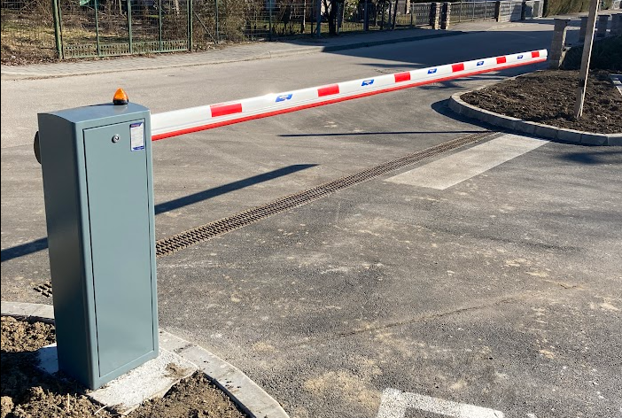
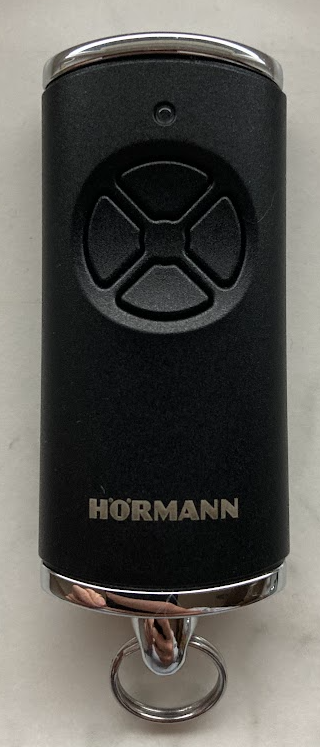
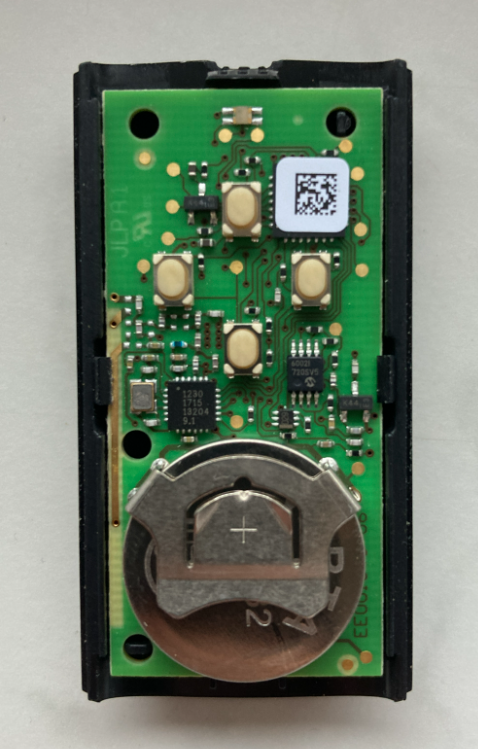
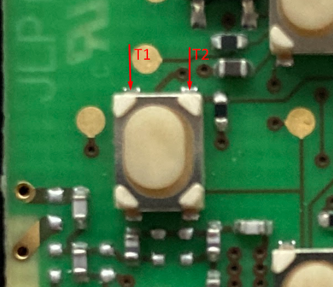
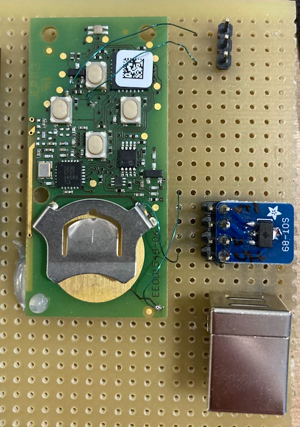
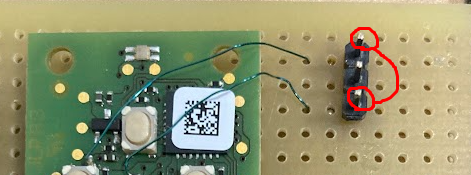
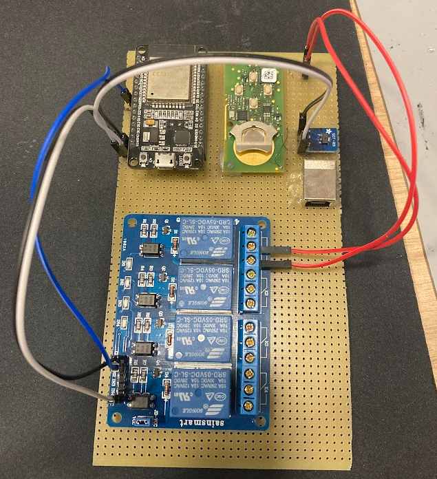
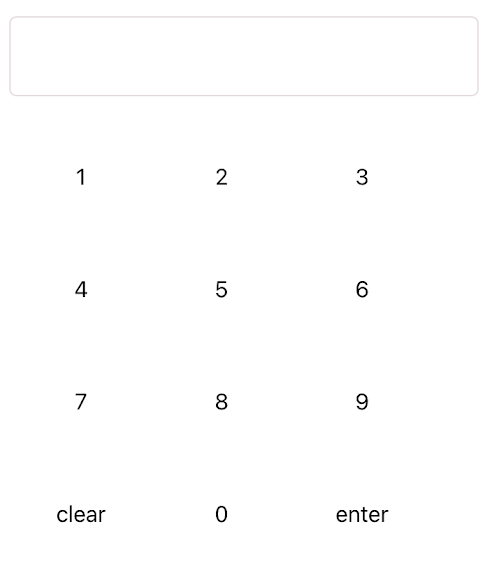
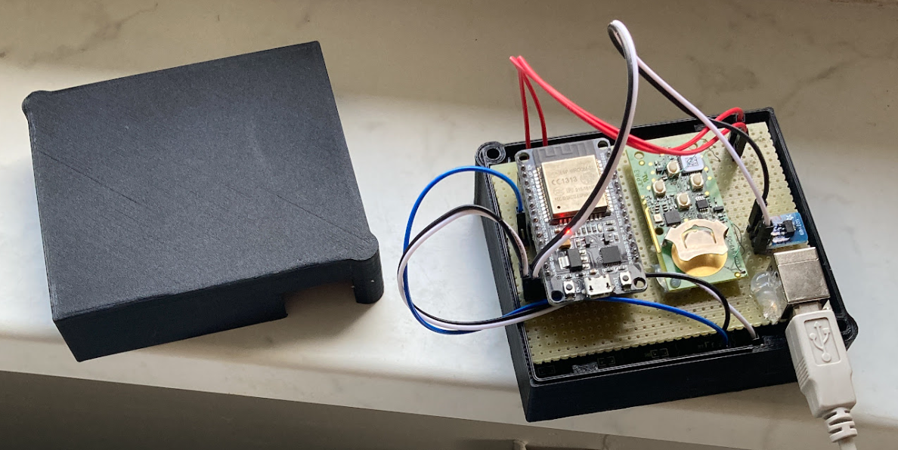
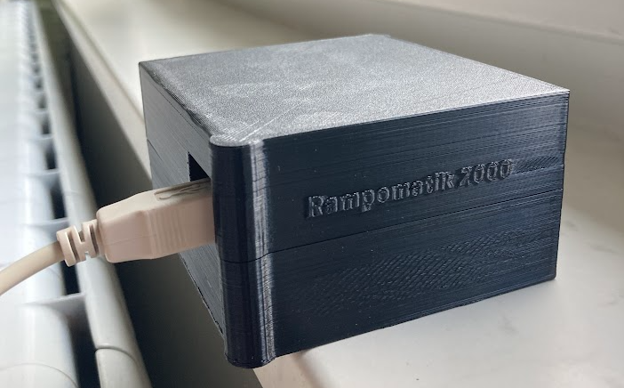

# ESP32 controlled Hörmann HSE 4 BS remote 🕹️

- [ESP32 controlled Hörmann HSE 4 BS remote 🕹️](#esp32-controlled-hörmann-hse-4-bs-remote-️)
  - [Problem 🚧](#problem-)
  - [Ideas 💭](#ideas-)
  - [The process of making my remote control remote controlled 😉](#the-process-of-making-my-remote-control-remote-controlled-)
  - [Parts list ⚡](#parts-list-)
  - [Credits 🙏](#credits-)

---

## Problem 🚧

In front of my house, the new owner renovated an old building into a new multi-apartment facility, and we also got a new parking lot with a nice fancy Hörmann parking gate. So the driveway to our house was blocked. Our household was only given two remotes (Hörmann HSE 4 BS) that could open the gate. That was a problem because we own multiple cars and multiple people live in the house. Therefore, it was quite a logistic challenge to know who has the remote with him and is in range to open the gate. Also, it was an unpleasant experience for our visitors who had to wait in front of the gate. They had to call us before they could enter. After a while, another problem occurred. The battery in the remote got a bit drained and the range of the remote went from 50 meters to around 25 meters. This meant that you had to walk outside the house closer to the gate to open it. Real pain in the rain to quickly open the gate while your visitor is waiting on the street.    

## Ideas 💭
The simple solution would be to buy more remotes, and that’s it. But this still wouldn’t fix the issue of remote range. By the way, the remotes cost more than 50€, which is not cheap if I want to give one to all my friends.

Hörmann also sells official modules that could upgrade the gate. For example, a mobile module, so the gate would open if you called a specified phone number or a Wi-fi module… But I am not the owner of the Hörmann gate, so I cannot buy these modules and upgrade the gate. 

So, I got an idea. What if I could put my Hörmann remote in a position (inside my house) where it would be in range to open the gate, and then remotely trigger that remote to open the gate?

## The process of making my remote control remote controlled 😉
I started exploring. My goal was to figure out how to trigger the buttons on the remote without clicking the buttons. Firstly I opened up the remote and checked the circuit.  

The remote            |  The remote circuit
:-------------------------:|:-------------------------:
  |  

On the circuit, I found four buttons that can open the gate (buttons need to be pre-programmed with the master remote). These are normal [push buttons](https://components101.com/switches/push-button) which means we can simulate the button press if we short the connection between the left and the right button terminals (T1 and T2).  

  
[Gif Source 2022](https://components101.com/switches/push-button)

Now that we know how to simulate the button press, we need to choose a method to do it. There are two ways to accomplish this. The first is with relays, and the second is with transistors. I chose the relay method because it is simple and intuitive. You just wire it up in parallel and the original button still works but now you can trigger it with a relay. The only downside is that it is a bit louder because relays make this clicking sound when they are triggered. The method with transistors would be silent but we would need to figure out how the buttons are wired up and that requires more electrical knowledge than I have. 😅

Now we have to figure out where to solder the wires on this small circuit. I started tracing circuit traces with a digital multimeter. My intention was to find the most suitable solder spots for the wires on the remote circuit. I also found the soldering points for the power so we can remove the battery and always have a "full charge" by powering the remote from an external source. The solder points are chosen in a way so they change the remote as little as possible. We can just cut off the wires and the remote should work as usual.

Because the components are small and I am not capable of soldering such small components, I gave the remote circuit to my friend, who can do that. He soldered the wires on the agreed spots. This is what he gave back to me. He also installed the USB B connector with a chip that outputs 5V and 3V so we can ditch the battery.    
  

Now if we plug in the USB with power and short these two pins for a second it is the same as pressing the button. The gate opens and there are no range problems when powering the circuit with USB. I was so happy to see the gate open on my first try and was relieved that we didn't damage the board with our modifications. 😄

Let's wire up those pins to a relay and connect it to the ESP32 so we can programmatically trigger the remote.  

After everything was wired up I uploaded the [code](./source-code/source-code.ino) on my ESP32. The code contains a basic webserver that hosts a basic pin UI that looks like this:  

It also contains a basic API that checks if the sent pin number is correct and if it is it triggers a relay that opens the gate. Otherwise, it sends back a bad request that indicates that the pin number received by the web server is wrong.

Now if I type in a browser my ESP32 local IP. I can see the pin number UI and if I type it in correctly the gate opens. Yay, now I can open the gate from my phone or computer. Cool, but I still need to be in my house connected to the same network as my ESP32. We can fix that with some router settings and [port forwarding](https://en.wikipedia.org/wiki/Port_forwarding), which depend on your router type. With proper settings in place, we can actually open the gate from anywhere. If I go to my public IP I will be redirected to my exposed ESP32 where I can type in the pin number and the gate should open. Now that is cool but we can make it even better. When I am driving the car I don't want to open the pin number UI and then type in the pin to open the gate. I am an iPhone user and I remembered I have [Apple Shortcuts](https://support.apple.com/en-gb/guide/shortcuts/welcome/ios#:~:text=A%20shortcut%20is%20a%20quick,launches%20your%20surf%20music%20playlist.) there so I made a shortcut application that talks directly to the API. I named it "Open The Gate" and now when I am driving the car and I am near my house I can just say: _"Hey Siri Open The Gate"_ and Siri says: _"On it"_ and the gate opens in a few seconds. Now that is really cool! 😎 

Also, I can just AirDrop this "virtual remote" to my friends. (I also figured out a solution for my Android friends. 😊) 

Now that everything works let's tidy things up in a neat package. Our circuit board is still a bit messy and unprotected so let's fix that and fit the circuit in a simple 3D-printed box. 

And this is the story of how Rampomatik 2000 was born. 🙌

## Parts list ⚡
- [ESP32](https://www.aliexpress.com/item/1005004268911484.html?spm=a2g0o.productlist.main.1.1b977404EQ2jv7&algo_pvid=3759b9b0-4379-484d-bfa9-1242cc5cb513&aem_p4p_detail=20221130125231862443391584420007711908&algo_exp_id=3759b9b0-4379-484d-bfa9-1242cc5cb513-0&pdp_ext_f=%7B%22sku_id%22%3A%2212000028838235689%22%7D&pdp_npi=2%40dis%21EUR%214.52%213.62%21%21%21%21%21%40214527c616698415515983978d07c7%2112000028838235689%21sea&curPageLogUid=K8rEilLw1p1Z&ad_pvid=20221130125231862443391584420007711908_1&ad_pvid=20221130125231862443391584420007711908_1) the brains
- [Hörmann HSE 4 BS](https://www.amazon.de/-/en/H%C3%B6rmann-4511736-Handheld-Transmitter-Black/dp/B01LO54TGU/ref=sr_1_2?crid=ZWYD71GC78CW&keywords=h%C3%B6rmann%2Bhse4%2Bbs&qid=1669841712&sprefix=h%C3%B6rmann%2Bhse4%2Bbs%2Caps%2C92&sr=8-2&th=1) the remote

- [Arduino single relay module](https://www.aliexpress.com/item/1005003249627194.html?spm=a2g0o.productlist.main.1.60c01e63XtUXVc&algo_pvid=78303782-9d88-4d77-9b7e-9254e28c9427&aem_p4p_detail=2022113012561910525297922839560007483356&algo_exp_id=78303782-9d88-4d77-9b7e-9254e28c9427-0&pdp_ext_f=%7B%22sku_id%22%3A%2212000024853952479%22%7D&pdp_npi=2%40dis%21EUR%212.02%211.92%21%21%21%21%21%402100bc5c16698417794615758d0752%2112000024853952479%21sea&curPageLogUid=yrCRG5sLg8Ub&ad_pvid=2022113012561910525297922839560007483356_1&ad_pvid=2022113012561910525297922839560007483356_1) the switch
- [SOT-89]() chip for power management (ask the electrician for this one 😅)

## Credits 🙏
- [Rui Santos example](https://randomnerdtutorials.com/esp32-async-web-server-espasyncwebserver-library/) helped me a lot. Thank you.