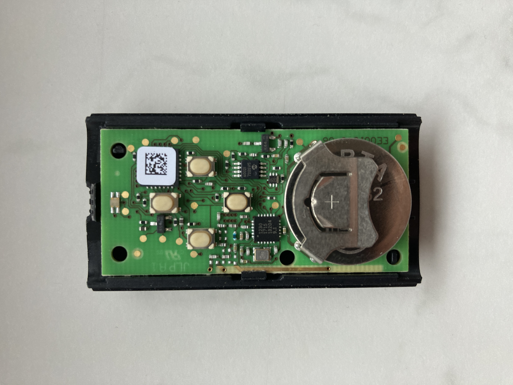

# ESP32 controlled Hörmann HSE 4 BS remote

## Problem 

In front of my house, the new owner renovated an old building into a new multi-apartment facility, and we also got a new parking lot with a nice fancy Hörmann parking gate. Our household was only given two remotes (Hörmann HSE 4 BS) that could open the gate. That was a problem because we own three cars and five people live in the house. Therefore, it was quite a logistic challenge to know who has the remote with him and is in range to open the gate. Also, this was an unpleasant experience for our visitors who had to wait in front of the gate. Then had to call us before they could enter. After a while, another problem occurred. The battery in the remote got a bit drained and the range of the remote went from 50 meters to around 25 meters. This meant that you had to walk outside the house closer to the gate to open it. Real pain in the rain to quickly open the gate while your visitor is waiting on the street.

## Ideas
The simple solution would be to buy more remotes, and that’s it. But this still wouldn’t fix the issue of remote range. By the way, the remotes cost more than 50€, which is not cheap if I want to give one to all my friends 😊

Hörmann also sells official modules that could upgrade the gate. For example, a mobile module, so the gate would open if you called a specified phone number or a Wi-fi module… But I am not the owner of the Hörmann gate, so I cannot buy these modules and upgrade the gate. 

So, I got an idea. What if I could put my Hörmann remote in a position (inside my house) where it would be in range to open the gate, and then remotely trigger that remote to open the gate?

I started exploring. My goal was to figure out how to trigger the buttons on the remote without clicking the buttons. Firstly I opened up the remote and checked the circuit.  

On the circuit, I found four buttons that can open the gate (buttons need to be pre-programmed with the master remote). These are normal push buttons 

The buttons were very small so I started tracing circuit traces with a digital multimeter. My intention was to find better solder spots 

## solution

## Prerequisites

# Credits
